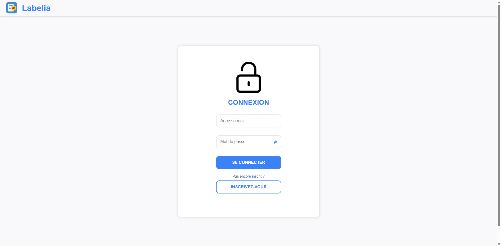
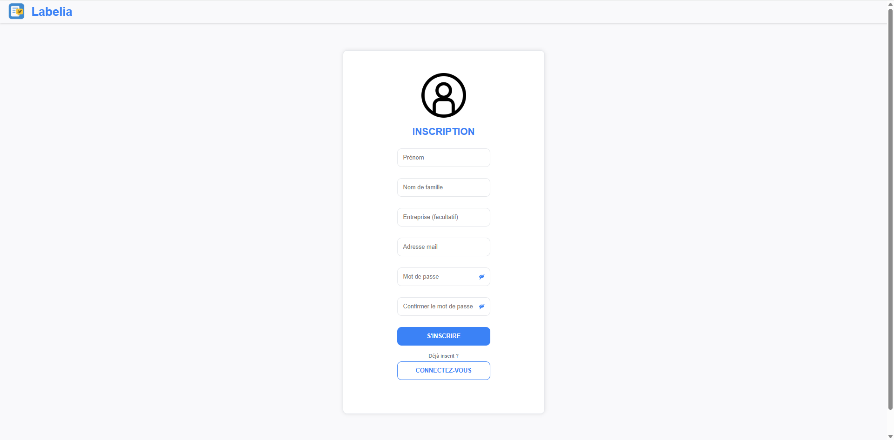
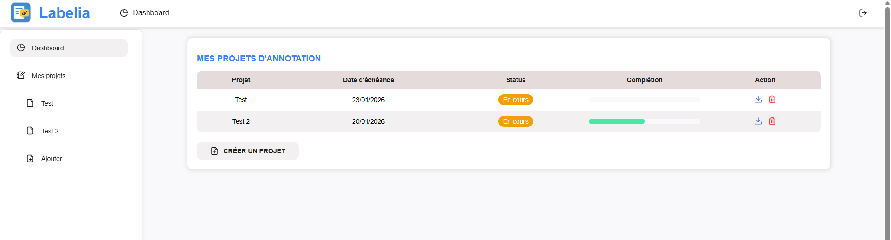
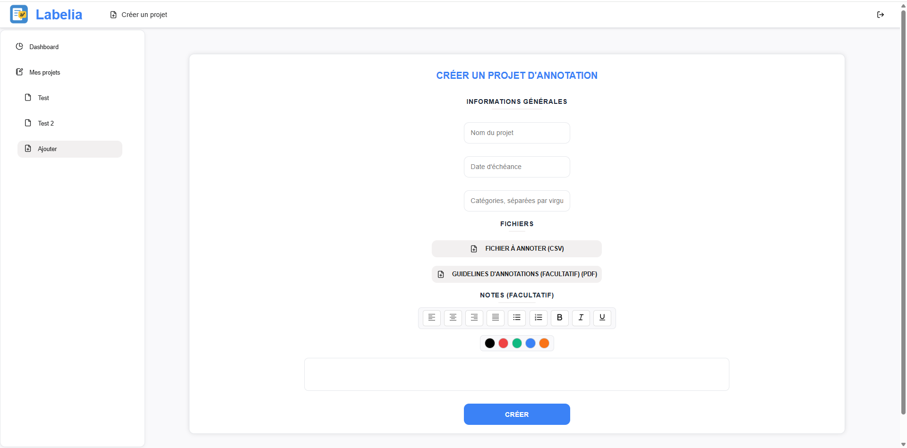
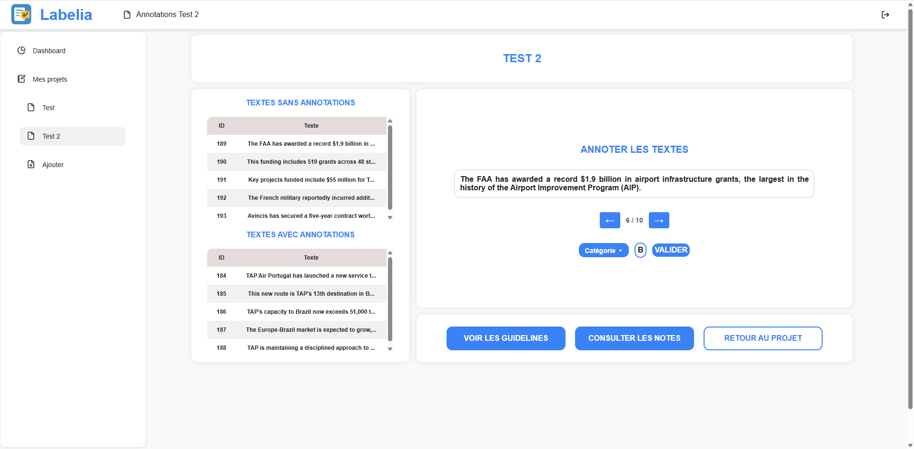

# Labelia

> Petit projet perso pour travailler et apprendre à utiliser FastAPI, React et SQLAlchemy

C'est une petite application permettant de créer des projets d'annotation, de charger des fichiers CSV, d'annoter des textes ligne par ligne et d'exporter les résultats. 

## Fonctionnalités principales

- Créer et gérer des projets avec fichiers CSV d'annotation et des guidelines sous format PDF
- Annoter ligne par ligne sur une interface simple
- Suivi du taux de complétion des projets
- Export des annotations en CSV
- Authentification des utilisateurs avec JWT
- Supression de projets et nettoyage des fichiers associés

> Note : ce n'est pas un véritable outil professionnel, juste un petit projet perso 😄

## Technologies utilisées

- Python
- JavaScript
- CSS
- FastAPI
- SQLAlchemy
- PostgreSQL
- Pydantic
- React
- JWT

## Installation

1. Créer votre base de données PostgreSQL avec les tables suivantes :

- Table "users"
    - id
    - email
    - password
    - created_at
    - first_name
    - last_name
    - company
    - failed_attempts
    - lock_until

- Table "projects"
    - id
    - user_id
    - project_name
    - due_date
    - annotation_file_path
    - guidelines_file_path
    - notes
    - created_at
    - status
    - categories
    - mean_annotations

- Table "annotations"
    - id
    - row_id
    - project_id
    - content
    - date


2. Cloner le repo

```bash
git clone https://github.com/florine-henriot/annotation-tool.git
cd annotation_tool
```

3. Créer un environnement virtuel
```bash
conda create -n labelia python=3.11
```

4. Installer les dépendances
```bash
conda activate labelia
pip install -r requirements.txt
```

5. Dans votre environnement virtuel conda, créez un fichier ```.bat``` avec les variables suivantes : 
```
@echo off
setx SECRET_KEY "votre clé de hash pour les mots de passe"
setx DATABASE_URL "votre base de données"
```

6. Lancer le projet
```bash 
cd chemin_backend
uvicorn main:app --reload --host 0.0.0.0 --port 8000
cd chemin_frontend 
npm start --host 0.0.0.0
```

## Utilisation
1. Créer un compte utilisateur
2. Créez un projet et téléverser votre fichier CSV
3. Annoter les lignes directement dans l'interface
4. Exportez vos annotations en CSV

/!\ Le CSV original téléverser doit contenir les colonnes suivantes, avec ces headers exacts :
- text_id
- text

## Quelques captures d'écran de l'interface

1. Page de login


2. Page d'inscription


3. Dashboard


4. Création de projet


5. Accès au projet


6. Page d'annotation
